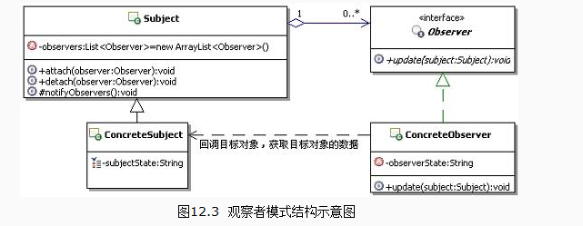

##定义
定义了一种一对多的依赖关系，让多个观察者对象同时监听某一个主题对象。这个主体对象在状态发生变化时，会通知所有观察者对象，使它们能够自动更新自己。
## UML



## 应用场景
减少对象之间的耦合有利于系统的复用，但是同时设计师需要使这些低耦合度的对象之间能够维持行动的协调一致，保证高度的协作。观察者模式是满足这一要求的各种设计方案中最重要的一种。

## 优点
抽象耦合
动态联动
广播通信

## 缺点
可能引起无谓的操作
##本质
触发联动

## 代码示例

```java
package com.cokid.observer;

import java.util.ArrayList;
import java.util.List;

public class Boss implements Subject {
    private List<Observer> observers = new ArrayList<>();
    private String action;
    @Override
    public void attach(Observer observer) {
        observers.add(observer);
    }

    @Override
    public void detach(Observer observer) {
        observers.remove(observer);
    }

    @Override
    public void notify_() {
        for(Observer observer : observers)
            observer.update();
    }

    @Override
    public String SubjectState() {
        return action;
    }

    @Override
    public void setSubjectState(String state) {
        this.action = state;
    }


}
package com.cokid.observer;

public abstract class Observer {
    protected String name;
    protected Subject sub;

    public Observer(String name, Subject sub) {
        this.name = name;
        this.sub = sub;
    }
    public abstract void update();

}
package com.cokid.observer;

public class ObserverClient {
    public static void main(String[] args) {
        Boss boss = new Boss();
        StockObserver tongshi1 = new StockObserver("Weiguancha", boss);
        StockObserver tongshi2 = new StockObserver("Yiguancha", boss);
        boss.attach(tongshi1);
        boss.attach(tongshi2);
        boss.setSubjectState("老板来了");
        boss.notify_();
    }
}
package com.cokid.observer;

public class StockObserver extends Observer {
    public StockObserver(String name, Subject sub) {
        super(name, sub);
    }

    @Override
    public void update() {
        System.out.println(sub.SubjectState() + " " + name + "继续工作");
    }
}
package com.cokid.observer;

public interface Subject {
    void attach(Observer observer);
    void detach(Observer observer);
    void notify_();
    String SubjectState();
    void setSubjectState(String state);

}
```