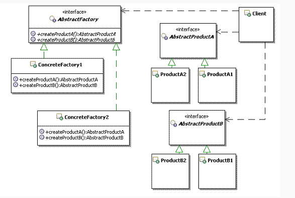

## 定义
提供了一个创建一系列相关或相互依赖对象的接口，而无需指定它们具体的类
## UML



## 应用场景
一个系统不依赖与产品如何被创建组合和表达的细节
一个系统有多个产品族，而系统只消费其中某一个产品族

## 优点
易于交换产品系列，由于具体工厂类在一个应用中只需要在初始化的时候出现一次，这就是的改变一个应用的具体工厂变得非常容易，它只需要改变具体工厂即可使用不同的产品配置。
它让具体的创建实例过程与客户端分离，客户端是通过它们的抽象接口操纵实例，产品的具体类名也被具体工厂的实现分离，不会出现在客户端代码中。

## 缺点
改动时会改动大批量代码
## 本质
选择产品族的实现

```java
package com.cokid.absFactory;

public class AbsFactoryClient {
    private static final String AssemblyName = "com.cokid.absFactory";
    private static final String db = "SqlServer";

    public static void main(String[] args) throws Exception{
        User user = new User();
        String className = AssemblyName + "." + db + "User";
        Class<?> cls = Class.forName(className);
        IUser iu = (IUser) cls.newInstance();
        iu.insert(user);
        iu.getUser(1);
    }

package com.cokid.absFactory;

public class AccessFactory implements IFactory {
    @Override
    public IUser createUser() {
        return new AccessUser();
    }
}
package com.cokid.absFactory;

public class AccessUser implements IUser {
    @Override
    public void insert(User user) {
        System.out.println("在 Access 中给User表增加一条记录");
    }

    @Override
    public User getUser(int id) {
        System.out.println("在 Access 中根据 id 返回一条记录");
        return null;
    }
}
package com.cokid.absFactory;

public interface IFactory {
    IUser createUser();
}
package com.cokid.absFactory;

public interface IUser {
    void insert(User user);
    User getUser(int id);
}
package com.cokid.absFactory;

public class SqlServerFactory implements IFactory {
    @Override
    public IUser createUser() {
        return new SqlServerUser();
    }
}
package com.cokid.absFactory;

public class SqlServerUser implements IUser {
    @Override
    public void insert(User user) {
        System.out.println("在 SQLServer 中给User表增加一条记录");
    }

    @Override
    public User getUser(int id) {
        System.out.println("在 SQLServer 中根据 id 返回一条记录");
        return null;
    }
}
package com.cokid.absFactory;

public class User {
    private int id;
    private String name;

    public int getId() {
        return id;
    }

    public void setId(int id) {
        this.id = id;
    }

    public String getName() {
        return name;
    }

    public void setName(String name) {
        this.name = name;
    }
}
```