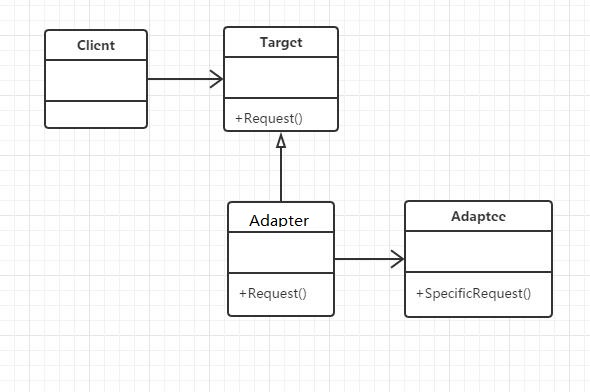

## 定义
将一个类的接口转换成客户希望那个的另外一个接口。Adapter模式使得原本由于接口不兼容而不能一起工作的那些类可以一起工作。
## UML



## 应用场景
希望复用一些现存的类，但接口又与复用环境要求不一致的情况。在遗留代码复用类库迁移方面非常有用。
## 优点
可扩展性可复用性
## 缺点
过多使用会让系统非常凌乱，不容易整体进行把握。
类适配器利用多重继承，带来了高耦合

##本质
转换匹配，复用功能

## 代码示例

```java
package com.cokid.adapter;

public class Adaptee {
    public void specificRequest(){
        System.out.println("特殊请求！");
    }
}
package com.cokid.adapter;
public class Adapter extends Target {
    private Adaptee adaptee = new Adaptee();
    public void request(){
        adaptee.specificRequest();
    }
}
package com.cokid.adapter;

public class Target {
    public void request(){
        System.out.println("普通请求！");
    }
}
package com.cokid.adapter;

public class AdapterClient {
    public static void main(String[] args) {
        Target target = new Adapter();
        target.request();
    }
}
```