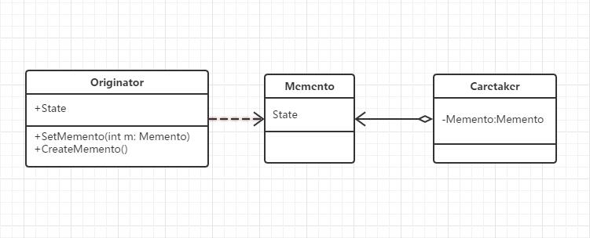

## 定义
在不破坏封装性的前提下，捕获一个对象的内部状态，并在该对象之外保存这个状态。这样以后就可将该对象恢复到原先保存的状态。
## UML



## 应用场景
必须保存一个对象在某一刻的全部或部分状态，方便以后恢复到先前的状态
## 优点
1把复杂的发起人的内部信息对其他人的对象隐蔽起来，从而可以恰当地保持封装的边界。
2简化了发起人类。发起人不需要管理和保存内部状态的一个个版本，客户端自行管理。
3使用暂时存储的备忘录进行状态复原。

## 缺点
资源消耗上面备忘录对象可能会很大，无法提醒用户一个操作是否很大。
##本质
保存和恢复内部状态

## 代码示例

```java
package com.cokid.memento;

public class GameRole {
    private int vlt;
    private int atk;
    private int def;

    public void getInitState(){
        this.vlt = 100;
        this.atk = 100;
        this.def = 100;
    }

    public void fight(){
        this.vlt = 0;
        this.atk = 0;
        this.def = 0;
    }

    public void stateDisplay(){
        System.out.println("角色当前状态：");
        System.out.println("体力：" + this.vlt);
        System.out.println("攻击力：" + this.atk);
        System.out.println("防御力：" + this.def);

    }

    public RoleStateMemento saveState(){
        return new RoleStateMemento(vlt, atk, def);
    }

    public void recoveryState(RoleStateMemento memento){
        this.vlt = memento.getVlt();
        this.atk = memento.getAtk();
        this.def = memento.getDef();
    }
}
package com.cokid.memento;

public class RoleStateCaretaker {
    private RoleStateMemento memento;

    public RoleStateMemento getMemento() {
        return memento;
    }

    public void setMemento(RoleStateMemento memento) {
        this.memento = memento;
    }
}
package com.cokid.memento;

public class RoleStateMemento {
    private int vlt;
    private int atk;
    private int def;

    public RoleStateMemento(int vlt, int atk, int def) {
        this.vlt = vlt;
        this.atk = atk;
        this.def = def;
    }

    public int getVlt() {
        return vlt;
    }

    public void setVlt(int vlt) {
        this.vlt = vlt;
    }

    public int getAtk() {
        return atk;
    }

    public void setAtk(int atk) {
        this.atk = atk;
    }

    public int getDef() {
        return def;
    }

    public void setDef(int def) {
        this.def = def;
    }
}
package com.cokid.memento;

public class Client {
    public static void main(String[] args) {
        GameRole lixiaoyao = new GameRole();
        lixiaoyao.getInitState();
        lixiaoyao.stateDisplay();

        RoleStateCaretaker stateAdmin = new RoleStateCaretaker();
        stateAdmin.setMemento(lixiaoyao.saveState());

        lixiaoyao.fight();
        lixiaoyao.stateDisplay();

        lixiaoyao.recoveryState(stateAdmin.getMemento());
        lixiaoyao.stateDisplay();
    }
}