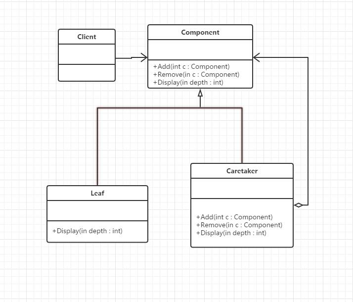

## 定义
将对象组合成树形结构以表示‘部分-整体‘的层次结构。组合模式使得用户对单个对象和组合对象的使用具有一致性。
## UML



## 应用场景
所有可以使用对象树来描述或操作的功能都可以考虑使用组合模式。比如读取XML文件或对语句进行语法分析
## 优点
1定义了包含基本对象和组合对象的类层次结构
2统一了组合对象和叶子对象
3简化了客户端调用：不用区分组合对象和叶子对象
4更容易扩展

## 缺点
很难限制组合中的组件类型
##本质
统一叶子对象和组合对象

## 代码示例

```java
package com.cokid.composite;

public class Leaf extends Component {
    public Leaf(String name) {
        super(name);
    }

    @Override
    public void add(Component c) {
        System.out.println("Cannot add to a leaf");
    }

    @Override
    public void remove(Component c) {
        System.out.println("Cannot remove from a leaf");
    }

    @Override
    public void display(int depth) {
        for(int i = 0; i<depth;++i){
            System.out.print("-");
        }
        System.out.println(name);
    }
}
package com.cokid.composite;

import java.util.LinkedList;
import java.util.List;

public class Composite extends Component {
    private List<Component> children = new LinkedList<>();

    public Composite(String name) {
        super(name);
    }

    @Override
    public void add(Component c) {
        children.add(c);
    }

    @Override
    public void remove(Component c) {
        children.remove(c);
    }

    @Override
    public void display(int depth) {
        for(int i = 0; i<depth;++i){
            System.out.print("-");
        }
        System.out.println(name);
        for(Component component : children){
            component.display(depth + 2);
        }
    }
}
package com.cokid.composite;

public abstract class Component {
    protected String name;

    public Component(String name) {
        this.name = name;
    }

    public abstract void add(Component c);
    public abstract void remove(Component c);
    public abstract void display(int depth);

}
package com.cokid.composite;

public class Client {
    public static void main(String[] args) {
        Composite root = new Composite("root");
        root.add(new Leaf("Leaf A"));
        root.add(new Leaf("Leaf B"));

        Composite comp = new Composite("Composite X");
        comp.add(new Leaf("Leaf XA"));
        comp.add(new Leaf("Leaf XB"));

        root.add(comp);

        Composite comp2 = new Composite("Composite XY");
        comp2.add(new Leaf("Leaf XYA"));
        comp2.add(new Leaf("Leaf XYB"));

        comp.add(comp2);
        root.add(new Leaf("Leaf C"));

        Leaf leaf = new Leaf("Leaf D");
        root.add(leaf);
        root.remove(leaf);

        root.display(1);
    }
}