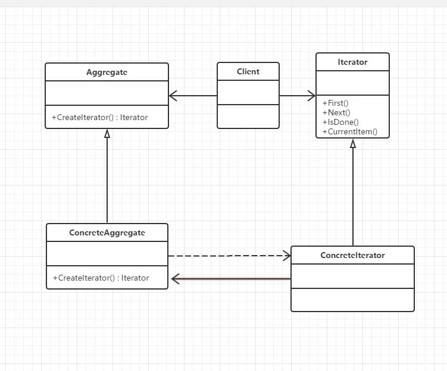

## 定义
提供一种方法顺序访问一个聚合对象中的各个元素，而又不暴露该对象的内部表示。
## UML



## 应用场景
当需要访问一个聚类对象，而且不管这些对象是什么都需要遍历的时候。
当需要对聚类有多种方式遍历时

## 优点
既可以不暴露集合的内部结构，又可以让外部代码透明地访问集合内部的数据。
## 代码示例

```c#
using System;
using System.Collections.Generic;
using System.Text;

namespace 迭代器模式
{
    class Program
    {
        static void Main(string[] args)
        {
            ConcreteAggregate a = new ConcreteAggregate();

            a[0] = "大鸟";
            a[1] = "小菜";
            a[2] = "行李";
            a[3] = "老外";
            a[4] = "公交内部员工";
            a[5] = "小偷";

            Iterator i = new ConcreteIterator(a);
            //Iterator i = new ConcreteIteratorDesc(a);
            object item = i.First();
            while (!i.IsDone())
            {
                Console.WriteLine("{0} 请买车票!", i.CurrentItem());
                i.Next();
            }

            Console.Read();
        }
    }

    abstract class Aggregate
    {
        public abstract Iterator CreateIterator();
    }

    class ConcreteAggregate : Aggregate
    {
        private IList<object> items = new List<object>();
        public override Iterator CreateIterator()
        {
            return new ConcreteIterator(this);
        }

        public int Count
        {
            get { return items.Count; }
        }

        public object this[int index]
        {
            get { return items[index]; }
            set { items.Insert(index, value); }
        }
    }

    abstract class Iterator
    {
        public abstract object First();
        public abstract object Next();
        public abstract bool IsDone();
        public abstract object CurrentItem();
    }

    class ConcreteIterator : Iterator
    {
        private ConcreteAggregate aggregate;
        private int current = 0;

        public ConcreteIterator(ConcreteAggregate aggregate)
        {
            this.aggregate = aggregate;
        }

        public override object First()
        {
            return aggregate[0];
        }

        public override object Next()
        {
            object ret = null;
            current++;

            if (current < aggregate.Count)
            {
                ret = aggregate[current];
            }

            return ret;
        }

        public override object CurrentItem()
        {
            return aggregate[current];
        }

        public override bool IsDone()
        {
            return current >= aggregate.Count ? true : false;
        }

    }
		
}

```

