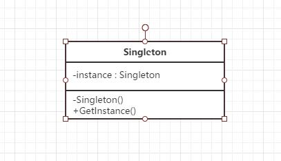

## 定义
保证一个类仅有一个实例，并提供一个访问它的全局访问点。
## UML



## 应用场景
系统要求一个类只有一个实例时
## 优点
1只有一个实例
2自己创建自己的唯一实例
3给所有其他对象提供这一实例

##本质
控制实例数目

## 代码示例

```c#
using System;
using System.Collections.Generic;
using System.Text;

namespace 单例模式
{
    class Program
    {
        static void Main(string[] args)
        {
            Singleton s1 = Singleton.GetInstance();
            Singleton s2 = Singleton.GetInstance();

            if (s1 == s2)
            {
                Console.WriteLine("Objects are the same instance");
            }

            Console.Read();
        }
    }

    class Singleton
    {
        private static Singleton instance;
        private static readonly object syncRoot = new object();
        private Singleton()
        {
        }

        public static Singleton GetInstance()
        {
            if (instance == null)
            {

                lock (syncRoot)
                {

                    if (instance == null)
                    {
                        instance = new Singleton();
                    }
                }
            }
            return instance;
        }

    }
}
```
