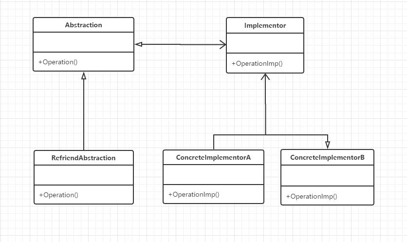

## 定义

将抽部分与它的实现部分分离，使它们可以独立地变化

## UML



## 优点

将抽象化和实现化脱耦使二者可以独立的变化

##本质

分离抽象和实现

## 代码示例

```c#
using System;
using System.Collections.Generic;
using System.Text;

namespace 桥接模式
{
    class Program
    {
        static void Main(string[] args)
        {
            Abstraction ab = new RefinedAbstraction();

            ab.SetImplementor(new ConcreteImplementorA());
            ab.Operation();

            ab.SetImplementor(new ConcreteImplementorB());
            ab.Operation();

            Console.Read();
        }
    }

    class Abstraction
    {
        protected Implementor implementor;

        public void SetImplementor(Implementor implementor)
        {
            this.implementor = implementor;
        }

        public virtual void Operation()
        {
            implementor.Operation();
        }

    }

    class RefinedAbstraction : Abstraction
    {
        public override void Operation()
        {
            implementor.Operation();
        }
    }

    abstract class Implementor
    {
        public abstract void Operation();
    }

    class ConcreteImplementorA : Implementor
    {
        public override void Operation()
        {
            Console.WriteLine("具体实现A的方法执行");
        }
    }

    class ConcreteImplementorB : Implementor
    {
        public override void Operation()
        {
            Console.WriteLine("具体实现B的方法执行");
        }
    }

}
```

