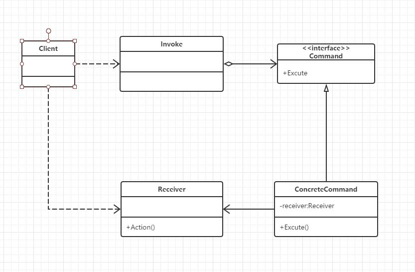

## 定义

将一个请求封装为一个对象，从而使你可用不同的请求对客户进行参数化；对请求排队或记录请求日志，以及支持可撤销的操作

## UML



## 应用场景

* 如果需要在不同的时刻指定、排列和执行请求，可以选用命令模式，把这些请求封装成为命令对象，然后实现把请求队列化
* 如果需要支持取消操作，可以选用命令模式，通过管理命令对象，能很容易的实现命令的恢复和重做的功能
* 在需要事务的系统中，可以选用命令模式，命令模式提供了对事务进行建模的方法，命令模式有一个别名就是Transaction。

## 优点

* 命令模式使新的命令很容易地被加入到系统里。
* 允许接收请求的一方决定是否要否决（Veto）请求。 
* 能较容易地设计一个命令队列。
* 可以容易地实现对请求的Undo和Redo。 
* 在需要的情况下，可以较容易地将命令记入日志。
* 命令模式把请求一个操作的对象与知道怎么执行一个操作的对象分割开。
* 命令类与其他任何别的类一样，可以修改和推广。

##本质

封装请求

## 代码示例

```c#
using System;
using System.Collections.Generic;
using System.Text;

namespace 命令模式
{
    class Program
    {
        static void Main(string[] args)
        {
            Receiver r = new Receiver();
            Command c = new ConcreteCommand(r);
            Invoker i = new Invoker();

            // Set and execute command 
            i.SetCommand(c);
            i.ExecuteCommand();

            Console.Read();

        }
    }
    abstract class Command
    {
        protected Receiver receiver;

        public Command(Receiver receiver)
        {
            this.receiver = receiver;
        }

        abstract public void Execute();
    }

    class ConcreteCommand : Command
    {
        public ConcreteCommand(Receiver receiver)
            :
          base(receiver) { }

        public override void Execute()
        {
            receiver.Action();
        }
    }

    class Receiver
    {
        public void Action()
        {
            Console.WriteLine("执行请求！");
        }
    }

    class Invoker
    {
        private Command command;

        public void SetCommand(Command command)
        {
            this.command = command;
        }

        public void ExecuteCommand()
        {
            command.Execute();
        }
    }
}

```


