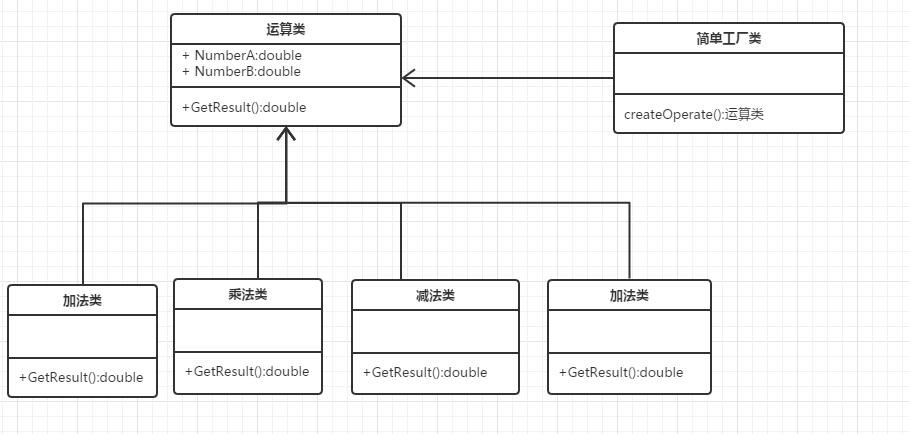

## UML



## 应用场景
* 如果想要完全封装隔离具体实现，让外部只能通过接口来操作封装体，那么可以选用简单工厂，让客户端通过工厂来获取相应的接口，而无需关心具体实现
* 如果想要把对外创建对象的职责集中管理和控制，可以选用简单工厂，一个简单工厂可以创建很多的、不相关的对象，可以把对外创建对象的职责集中到一个简单工厂来，从而实现集中管理和控制
## 优点
工厂类含有必要的判断逻辑，可以决定在什么时候创建哪一个产品类的实例，客户端可以免除直接创建产品对象的责任，而仅仅"消费"产品。简单工厂模式通过这种做法实现了对责任的分割
## 缺点
当产品有复杂的多层等级结构时，工厂类只有自己，以不变应万变，就是模式的缺点。因为工厂类集中了所有产品创建逻辑，一旦不能正常工作，整个系统都要受到影响。
同时，系统扩展困难，一旦添加新产品就不得不修改工厂逻辑，有可能造成工厂逻辑过于复杂。
另外，简单工厂模式通常使用静态工厂方法，这使得无法由子类继承，造成工厂角色无法形成基于继承的等级结构。
##本质
选择实现

## 代码示例

```java
package org.cokid.factory;
public abstract class Operation {
    private double numberA = 0;
    private double numberB = 0;
    
    public double getNumberA() {
        return numberA;
    }
    
    public void setNumberA(double numberA) {
        this.numberA = numberA;
    }
    
    public double getNumberB() {
        return numberB;
    }
    
    public void setNumberB(double numberB) {
        this.numberB = numberB;
    }
    
    abstract public double getResult() throws Exception;
}
package org.cokid.factory;
public class OperationAdd extends Operation{
    @Override
    public double getResult() {
        return this.getNumberA() + this.getNumberB();
    }
}
package org.cokid.factory;
public class OperationDiv extends Operation{
    @Override
    public double getResult() throws Exception{
        if(this.getNumberB() == 0)
            throw new Exception("INF");
        return this.getNumberA() / this.getNumberB();
    }
}
package org.cokid.factory;
public class OperationMul extends Operation {
    @Override
    public double getResult() {
        return this.getNumberA() * this.getNumberB();
    }
}
package org.cokid.factory;
public class OperationSub extends Operation{

    @Override
    public double getResult() {
        return this.getNumberA() - this.getNumberB();
    }
}
package org.cokid.factory;
public class OperationFactory {
    public static Operation createOperation(String operate) throws Exception{
        Operation oper = null;
        Class<?> cls = Class.forName(operate);
    
        try{
            oper =  (Operation)cls.newInstance();
        }catch (Exception e){
            System.out.println("Error");
            e.printStackTrace();
    
        }
        return oper;
    }
}

package org.cokid.factory;

public class OperationClient {
    public static void main(String[] args)throws Exception {
        Operation oper = OperationFactory.createOperation("org.cokid.factory.OperationAdd");
        oper.setNumberA(12.0);
        oper.setNumberB(13.0);
        System.out.println(oper.getResult());
    }
}
```