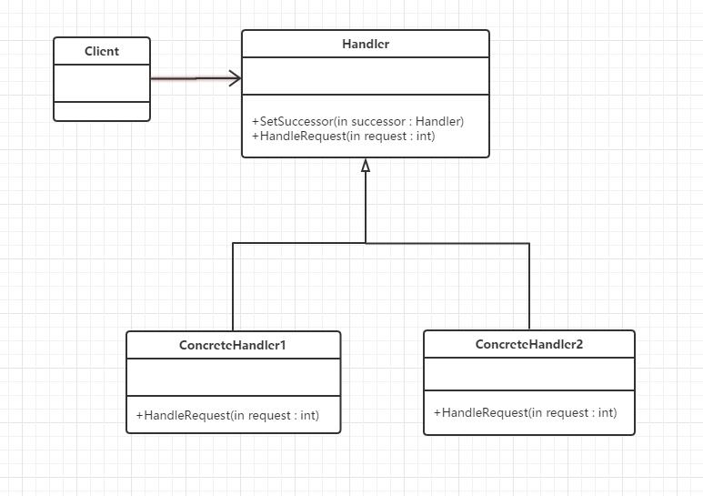

## 定义
使多个对象都有机会处理请求，从而避免请求的发送者和接受者之间的耦合关系。将这个对象连成一条链，并沿着这条链传递该请求，直到有一个对象处理它为止。
## UML



## 优点
请求者和接受者松散耦合，动态组合职责。
## 缺点
产生很多细粒度对象不一定能被处理
## 本质
分离职责动态组合

## 代码示例

```java
package com.cokid.chain;

public class CommonManager extends Manager{

    public CommonManager(String name) {
        super(name);
    }

    @Override
    public void RequestApplication(Request request) {
        if(request.getRequestType().equals("请假") && request.getNumber() <= 2){
            System.out.println(request.getRequestType() + "数量：" + request.getNumber() + "批准");
        }else {
            if(superior != null)
                superior.RequestApplication(request);
        }
    }
}
package com.cokid.chain;

public class GeneralManager extends Manager {
    public GeneralManager(String name) {
        super(name);
    }

    @Override
    public void RequestApplication(Request request) {
        if(request.getRequestType().equals("请假")){
            System.out.println(request.getRequestType() + "数量：" + request.getNumber() + "批准");
        }else if(request.getRequestType().equals("加薪") && request.getNumber() <= 500){
            System.out.println(request.getRequestType() + "数量：" + request.getNumber() + "批准");
        }else if(request.getRequestType().equals("加薪") && request.getNumber() > 500){
            System.out.println("再说吧");
        }else {
            if(superior != null)
                superior.RequestApplication(request);
        }
    }
}
package com.cokid.chain;

public class Major extends Manager {
    public Major(String name) {
        super(name);
    }

    @Override
    public void RequestApplication(Request request) {
        if(request.getRequestType().equals("请假") && request.getNumber() <= 5){
            System.out.println(request.getRequestType() + "数量：" + request.getNumber() + "批准");
        }else {
            if(superior != null)
                superior.RequestApplication(request);
        }
    }

}
package com.cokid.chain;

public abstract class Manager {
    protected String name;
    protected Manager superior;

    public Manager(String name) {
        this.name = name;
    }

    public void setSuperior(Manager superior) {
        this.superior = superior;
    }

    public abstract void RequestApplication(Request request);
}
package com.cokid.chain;

public class Request {
    private String requestType;
    private String requestContent;
    private int number;

    public String getRequestType() {
        return requestType;
    }

    public void setRequestType(String requestType) {
        this.requestType = requestType;
    }

    public String getRequestContent() {
        return requestContent;
    }

    public void setRequestContent(String requestContent) {
        this.requestContent = requestContent;
    }

    public int getNumber() {
        return number;
    }

    public void setNumber(int number) {
        this.number = number;
    }
}
package com.cokid.chain;

public class Client {
    public static void main(String[] args) {
        CommonManager cm = new CommonManager("金利");
        Major major = new Major("宗建");
        GeneralManager gm = new GeneralManager("钟精厉");
        cm.setSuperior(major);
        major.setSuperior(gm);
        Request request = new Request();
        request.setNumber(3);
        request.setRequestType("请假");
        cm.RequestApplication(request);

        request.setNumber(600);
        request.setRequestType("加薪");
        cm.RequestApplication(request);
    }
}