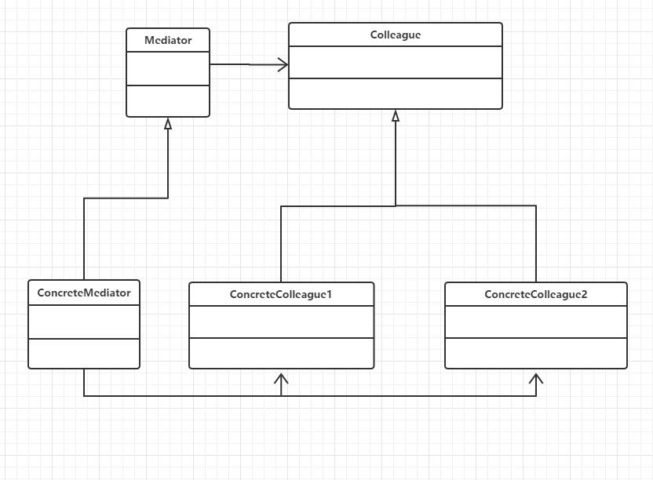

## 定义
用一个中介对象来封装一系列的对象交互。中介者使各对象不需要显式地相互引用，从而使其耦合松散，而且可以独立地改变他们之间的交互。
## UML



## 应用场景
需要将多对多通信转化为一对多通信
## 优点
1将多对多通信转化为一对多通信，简化了系统的复杂性
2中介者获得了系统解耦的特性
3 控制集中
## 缺点
由于控制集中化，增加了中介者的复杂性。
##本质
封装交互

## 代码示例

```java
package com.cokid.Mediator;

public class Client {
    public static void main(String[] args) {
        UnitedNationsSecurityCouncil UNSC = new UnitedNationsSecurityCouncil();
        USA c1 = new USA(UNSC);
        Iraq c2 = new Iraq(UNSC);
        UNSC.setColleague1(c1);
        UNSC.setColleague2(c2);
        c1.declare("不准研制核武器，否则发动战争！");
        c2.declare("我们没有核武器，也不怕侵略");
    }
}
package com.cokid.Mediator;

public abstract class Country {
    protected UniteNations mediator;

    public Country(UniteNations mediator) {
        this.mediator = mediator;
    }
}
package com.cokid.Mediator;

public class Iraq extends Country{
    public Iraq(UniteNations mediator) {
        super(mediator);
    }
    public void declare(String message){
        mediator.declare(message, this);
    }
    public void getMessage(String message){
        System.out.println("伊拉克获得对方信息：" + message);
    }
}
package com.cokid.Mediator;

public class UnitedNationsSecurityCouncil extends UniteNations {
    private USA colleague1;
    private Iraq colleague2;

    public void setColleague1(USA colleague1) {
        this.colleague1 = colleague1;
    }

    public void setColleague2(Iraq colleague2) {
        this.colleague2 = colleague2;
    }

    @Override
    public void declare(String massage, Country colleague) {
        if(colleague == colleague1) {
            colleague2.getMessage(massage);
        }else {
            colleague1.getMessage(massage);
        }
    }
}
package com.cokid.Mediator;

public abstract class UniteNations {
    public abstract void declare(String massage, Country colleague);
}
package com.cokid.Mediator;

public class USA extends Country{
    public USA(UniteNations mediator) {
        super(mediator);
    }
    public void declare(String message){
        mediator.declare(message, this);
    }
    public void getMessage(String message){
        System.out.println("美国获得对方信息：" + message);
    }
}
```