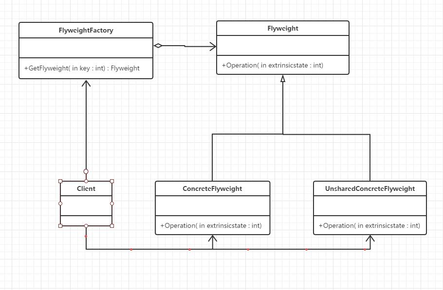

## 定义

运用共享技术有效地支持大量细粒度的对象

## UML



## 应用场景

* 一个系统有大量的对象。 
* 这些对象耗费大量的内存。 
* 这些对象的状态中的大部分都可以外部化。 
* 这些对象可以按照内部状态分成很多的组，当把外部对象从对象中剔除时，每一个组都可以仅用一个对象代替。

## 优点

大幅度地降低内存中对象的数量节省内存空间。

## 缺点

* 享元模式使得系统更加复杂。为了使对象可以共享，需要将一些状态外部化，这使得程序的逻辑复杂化。
* 享元模式将享元对象的状态外部化，而读取外部状态使得运行时间变长。

##本质

分离与共享

## 代码示例

```c#
using System;
using System.Collections.Generic;
using System.Collections;
using System.Text;

namespace 享元模式
{
    class Program
    {
        static void Main(string[] args)
        {
            int extrinsicstate = 22;

            FlyweightFactory f = new FlyweightFactory();

            Flyweight fx = f.GetFlyweight("X");
            fx.Operation(--extrinsicstate);

            Flyweight fy = f.GetFlyweight("Y");
            fy.Operation(--extrinsicstate);

            Flyweight fz = f.GetFlyweight("Z");
            fz.Operation(--extrinsicstate);

            UnsharedConcreteFlyweight uf = new UnsharedConcreteFlyweight();

            uf.Operation(--extrinsicstate);

            Console.Read();
        }
    }

    class FlyweightFactory
    {
        private Hashtable flyweights = new Hashtable();

        public FlyweightFactory()
        {
            flyweights.Add("X", new ConcreteFlyweight());
            flyweights.Add("Y", new ConcreteFlyweight());
            flyweights.Add("Z", new ConcreteFlyweight());

        }

        public Flyweight GetFlyweight(string key)
        {
            return ((Flyweight)flyweights[key]);
        }
    }

    abstract class Flyweight
    {
        public abstract void Operation(int extrinsicstate);
    }

    class ConcreteFlyweight : Flyweight
    {
        public override void Operation(int extrinsicstate)
        {
            Console.WriteLine("具体Flyweight:" + extrinsicstate);
        }
    }

    class UnsharedConcreteFlyweight : Flyweight
    {
        public override void Operation(int extrinsicstate)
        {
            Console.WriteLine("不共享的具体Flyweight:" + extrinsicstate);
        }
    }
}

```

