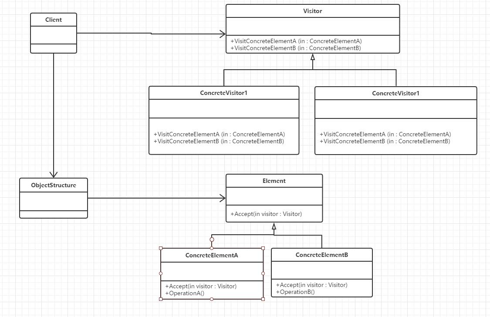

## 定义

表示一个作用于某对象结构中的各元素的操作。它使你可以在不改变各元素的类的前提下定义作用于这些元素的新操作

## UML



## 应用场景

* 访问者模式适用于数据结构相对稳定的系统，它把数据结构和作用于结构上的操作之间的耦合解脱开，使得操作集合可以相对自由地演化。
* 访问者模式仅应当在被访问的类结构非常稳定的情况下使用

## 优点

* 访问者模式使得增加新的操作变得很容易。增加新的操作就意味着增加一个新的访问者类。
* 访问者模式将有关的行为集中到一个访问者对象中，而不是分散到一个个的节点类中。

## 缺点

* 增加新的节点类变得很困难。每增加一个新的节点都意味着要在抽象访问者角色中增加一个新的抽象操作，并在每一个具体访问者类中增加相应的具体操作。
* 破坏封装。访问者模式要求访问者对象访问并调用每一个节点对象的操作，这隐含了一个对所有节点对象的要求：它们必须暴露一些自己的操作和内部状态

##本质

预留通路，回调实现

## 代码示例

```c#
using System;
using System.Collections.Generic;
using System.Text;

namespace 访问者模式
{
    class Program
    {
        static void Main(string[] args)
        {
            ObjectStructure o = new ObjectStructure();
            o.Attach(new ConcreteElementA());
            o.Attach(new ConcreteElementB());

            ConcreteVisitor1 v1 = new ConcreteVisitor1();
            ConcreteVisitor2 v2 = new ConcreteVisitor2();

            o.Accept(v1);
            o.Accept(v2);

            Console.Read();
        }
    }

    abstract class Visitor
    {
        public abstract void VisitConcreteElementA(ConcreteElementA concreteElementA);

        public abstract void VisitConcreteElementB(ConcreteElementB concreteElementB);
    }

    class ConcreteVisitor1 : Visitor
    {
        public override void VisitConcreteElementA(ConcreteElementA concreteElementA)
        {
            Console.WriteLine("{0}被{1}访问", concreteElementA.GetType().Name, this.GetType().Name);
        }

        public override void VisitConcreteElementB(ConcreteElementB concreteElementB)
        {
            Console.WriteLine("{0}被{1}访问", concreteElementB.GetType().Name, this.GetType().Name);
        }
    }

    class ConcreteVisitor2 : Visitor
    {
        public override void VisitConcreteElementA(ConcreteElementA concreteElementA)
        {
            Console.WriteLine("{0}被{1}访问", concreteElementA.GetType().Name, this.GetType().Name);
        }

        public override void VisitConcreteElementB(ConcreteElementB concreteElementB)
        {
            Console.WriteLine("{0}被{1}访问", concreteElementB.GetType().Name, this.GetType().Name);
        }
    }

    abstract class Element
    {
        public abstract void Accept(Visitor visitor);
    }

    class ConcreteElementA : Element
    {
        public override void Accept(Visitor visitor)
        {
            visitor.VisitConcreteElementA(this);
        }

        public void OperationA()
        { }
    }

    class ConcreteElementB : Element
    {
        public override void Accept(Visitor visitor)
        {
            visitor.VisitConcreteElementB(this);
        }

        public void OperationB()
        { }
    }

    class ObjectStructure
    {
        private IList<Element> elements = new List<Element>();

        public void Attach(Element element)
        {
            elements.Add(element);
        }

        public void Detach(Element element)
        {
            elements.Remove(element);
        }

        public void Accept(Visitor visitor)
        {
            foreach (Element e in elements)
            {
                e.Accept(visitor);
            }
        }
    }
}
```

