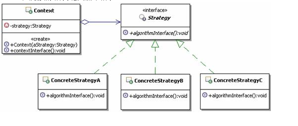

## 定义
它定义了算法家族，分别封装起来，让他们之间可以互相替换，此模式让算法的变化，不会影响到使用算法的客户
## UML



## 应用场景

* 出现有许多相关的类，仅仅是行为有差别的情况，可以使用策略模式来使用多个行为中的一个来配置一个类的方法，实现算法动态切换
* 出现同一个算法，有很多不同的实现的情况，可以使用策略模式来把这些“不同的实现”实现成为一个算法的类层次 
* 出现抽象一个定义了很多行为的类，并且是通过多个if-else语句来选择这些行为的情况，可以使用策略模式来代替这些条件语句

## 优点
可以以相同的方式调用所有的算法，减少了各种算法类与使用算法类之间的耦合
策略模式的Strategy类层为Context定义了一系列的可供重用的算法或行为。继承有助于析出析出算法中的公共功能。
简化了单元测试
将行为封装在一个个独立的Strategy类中，可以再使用这些行为的类中消除条件语句。

## 缺点
改客户端必须知道所有的策略类，增加对象的数目，只适合扁平的算法结构
##本质
分离算法选择实现

## 代码示例

```java
package org.cokid.strategy;

public class CashClient {
    public static void main(String[] args) {
        CashContext context = new CashContext("正常收费");
        System.out.println(context.getResult(500));

    }
}
package org.cokid.strategy;

public class CashContext {
    private CashSuper cs = null;
    public CashContext(String type){
        switch (type)
        {
            case "正常收费":
                CashNormal temp = new CashNormal();
                this.cs = temp;
                break;
            case "满300返100":
                CashReturn temp1 = new CashReturn(300.0, 100.0);
                this.cs = temp1;
                break;

            case "打8折":
                CashRebate temp2 = new CashRebate(0.8);
                this.cs = temp2;
                break;
        }
    }
    public double getResult(double money){
        return cs.acceptCash(money);
    }
}
package org.cokid.strategy;

public class CashNormal implements CashSuper {
    @Override
    public double acceptCash(double money) {
        return money;
    }
}
package org.cokid.strategy;

public class CashRebate implements CashSuper {
    private double moneyRebate = 1.0;
    public CashRebate(double moneyRebate){
        this.moneyRebate = moneyRebate;

    }


    @Override
    public double acceptCash(double money) {
        return money * moneyRebate;
    }
}
package org.cokid.strategy;

public class CashReturn implements CashSuper {
    private double moneyCondition = 0.0;
    private double moneyReturn = 0.0;
    public CashReturn(double moneyCondition, double moneyReturn){
        this.moneyCondition = moneyCondition;
        this.moneyReturn = moneyReturn;
    }

    @Override
    public double acceptCash(double money) {
        double result = money;
        if (money >= this.moneyCondition)
            result = money - Math.floor(money / this.moneyCondition) * this.moneyReturn;
        return result;
    }
}
package org.cokid.strategy;
public interface CashSuper {
    double acceptCash(double money);
}
```

