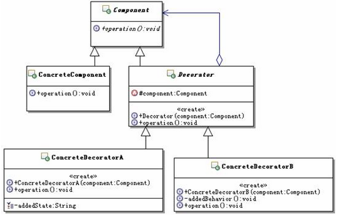

##定义
动态地给一个对象添加一些额外的职责。
## UML

## 

## 应用场景

- 如果需要在不影响其它对象的情况下，以动态、透明的方式给对象添加职责，可以使用装饰模式，这几乎就是装饰模式的主要功能
- 如果不合适使用子类来进行扩展的时候，可以考虑使用装饰模式，因为装饰模式是使用的“对象组合”的方式。所谓不适合用子类扩展的方式，比如：扩展功能需要的子类太多，造成子类数目呈爆炸性增长。

## 优点
装饰模式与继承关系的目的都是要扩展对象的功能，但是装饰模式可以提供比继承更多的灵活性。
通过使用不同的具体装饰类以及这些装饰类的排列组合，设计师可以创造出很多不同行为的组合。

## 缺点
会产生很多细粒度对象

## 本质
动态是手段，组合是目的

## 代码示例

```java
package org.cokid.decorator;

public class Finery implements  Component{
    protected Component component;
    public Finery(Component component){
        this.component = component;
    }

    @Override
    public void show() {
        if(component != null)
            component.show();
    }
}
package org.cokid.decorator;

public class BigTrouser extends Finery {
    public BigTrouser(Component component) {
        super(component);
    }

    @Override
    public void show() {
        System.out.println("垮裤");
    }
}
package org.cokid.decorator;

/**
 * Created by fly19 on 2017/3/29.
 */
public interface Component {
    void show();
}
package org.cokid.decorator;

public class Person implements Component{
    private String name;
    public Person(String name){
        this.name = name;
    }

    public void show(){
        System.out.println("装扮的" + this.name);
    }
}
package org.cokid.decorator;

public class Suit extends Finery {
    public Suit(Component component) {
        super(component);
    }

    @Override
    public void show() {
        System.out.println("Suit");
    }
}
package org.cokid.decorator;

public class Tie extends Finery {
    public Tie(Component component) {
        super(component);
    }

    @Override
    public void show() {
        System.out.println("Tie");
    }
}
package org.cokid.decorator;

public class TShirts extends Finery {
    public TShirts(Component component) {
        super(component);
    }

    @Override
    public void show() {
        System.out.println("大T-shirt");
    }
}
package org.cokid.decorator;

public class DecoratorClient {
    public static void main(String[] args) {
        Component xc = new Person("小菜");
        System.out.println("第一种装扮: ");
        Finery dtx = new TShirts(xc);
        Finery kk = new BigTrouser(xc);
        dtx.show();

    }
}
```