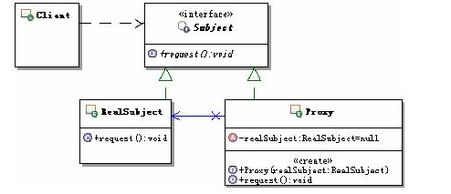

##定义
为其他对象提供一种代理以控制对这个对象的访问
## UML



## 应用场景
* 远程代理：也就是为一个对象在不同的地址空间提供局部代表。这样可以隐藏一个对象存在不同地址空间的事实。
* 虚拟代理：是根据需要创建开销很大的对象。通过它来存放实例化需要很长时间的真实对象
* 安全代理：用来控制真是对象访问时的权限。
* 智能指引：是指当调用真实对象时代理处理另外一些事。
* Copy-on-write代理：虚拟代理的一种，把复制拖延到只有在客户端需要时才真正实用。
* Cache代理：为那些昂贵操作结果提供临时的存储空间，以便多个客户端共享这种结果。
* 防火墙代理：保护目标，不让恶意目标接近；
* 同步化代理：使几个用户能够同时访问目标对象而没有冲突。


##本质
控制对象访问

## 代码示例

```java
package com.cokid.proxy;

public interface IGiveGift {
    void giveDolls();
    void giveFollowers();
    void giveChocolate();
}
package com.cokid.proxy;

public class Pursuit implements IGiveGift {
    private SchoolGirl mm;

    public Pursuit(SchoolGirl mm) {
        this.mm = mm;
    }

    @Override
    public void giveDolls() {
        System.out.println(mm.getName() + " 送你洋娃娃");
    }

    @Override
    public void giveFollowers() {
        System.out.println(mm.getName() + " 送你鲜花");
    }

    @Override
    public void giveChocolate() {
        System.out.println(mm.getName() + " 送你巧克力");
    }
}
package com.cokid.proxy;

public class SchoolGirl {
    private String name;

    public SchoolGirl(String name) {
        this.name = name;
    }

    public String getName() {
        return name;
    }

    public void setName(String name) {
        this.name = name;
    }
}
package com.cokid.proxy;

public class Proxy implements IGiveGift {
    private  Pursuit gg;

    public Proxy(SchoolGirl mm) {
        this.gg = new Pursuit(mm);
    }

    @Override
    public void giveDolls() {
        gg.giveDolls();
    }

    @Override
    public void giveFollowers() {
        gg.giveFollowers();
    }

    @Override
    public void giveChocolate() {
        gg.giveChocolate();
    }
}
package com.cokid.proxy;

public class ProxyClient {
    public static void main(String[] args) {
        SchoolGirl jiaojiao = new SchoolGirl("李娇娇");
        Proxy daili = new Proxy(jiaojiao);
        daili.giveChocolate();
    }

}