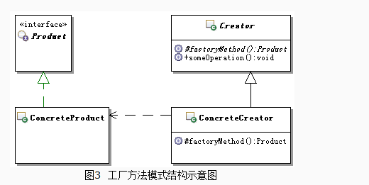

## 定义
定义一个用于创建对象的接口，让子类决定实例化哪一个类。工厂方法使一个类的实例化延迟到其子类。
## UML



## 应用场景
一个类需要创建接口对象但又不知道具体实现创建对象的工作，延迟到子类实现。
## 优点
克服了简单工厂违背开放-封闭原则的缺点，又保持了封装对象创建过程的优点。
集中封装了对象的创建，使得要更换对象时，不需要做大的改动就可实现，降低了客户程序与产品对象的耦合

## 缺点
具体产品对象与工厂方法的耦合性
##本质
延迟到子类来选择实现

## 代码示例

```java
package com.cokid.funcFactory;

import com.cokid.factory.Operation;
import com.cokid.factory.OperationAdd;

public class AddFactory implements IFactory {
    @Override
    public Operation createOperation() {
        return new OperationAdd();
    }
}
package com.cokid.funcFactory;


import com.cokid.factory.Operation;
import com.cokid.factory.OperationDiv;

public class DivFactory implements IFactory {
    @Override
    public Operation createOperation() {
        return new OperationDiv();
    }
}
package com.cokid.funcFactory;


import com.cokid.factory.Operation;
import com.cokid.factory.OperationMul;

public class MulFactory implements IFactory {
    @Override
    public Operation createOperation() {
        return new OperationMul();
    }
}
package com.cokid.funcFactory

import com.cokid.factory.Operation;
import com.cokid.factory.OperationSub;

public class SubFactory implements IFactory {
    @Override
    public Operation createOperation() {
        return new OperationSub();
    }
}
package com.cokid.funcFactory;

import com.cokid.factory.Operation;

public interface IFactory {
    Operation createOperation();
}
```