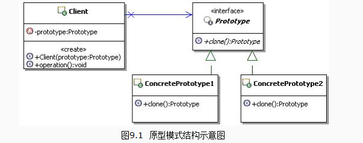

## 定义
用原型实例指定创建对象的种类，并且通过拷贝这些原型创建新的对象。
## UML

## 应用场景
克隆生成对象
你如果要生成一大批很相像的类的实例时，不用每次去做重复的赋值工作。
## 优点
允许动态地增加或减少产品类，提供了简化的创建结构
## 缺点
必须递归地让所有相关对象正确地克隆
##本质
克隆生成对象

## 代码示例

```java
package com.cokid.prototype;

public class Resume implements Cloneable {
    private String name;
    private String sex;
    private String age;
    private WorkExperience work;

    public Resume(String name) {
        this.name = name;
        work = new WorkExperience();
    }
    public void setPersonalInfo(String sex, String age){
        this.sex = sex;
        this.age = age;
    }
    public void setWorkExperience(String workDate, String company){
        work.setWorkDate(workDate);
        work.setCompany(company);
    }

    public void display(){
        System.out.println(name + " " + sex + " " + age);
        System.out.println("工作经历： " + work.getWorkDate() + " " + work.getCompany());
    }

    public Object clone() throws CloneNotSupportedException {
        super.clone();
        Resume temp = new Resume(this.name);
        temp.setPersonalInfo(this.sex, this.age);
        temp.setWorkExperience(this.work.getWorkDate(), this.work.getCompany());
        return (Object)temp;
    }

}
```