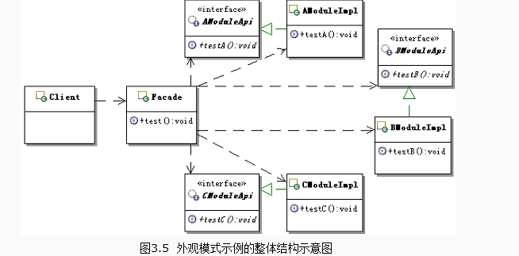

##定义
为子系统中的一组接口提供一个一致的界面，此模式定义了一个高层接口，这个接口是的这一子系统更加容易使用。
## UML



## 应用场景
1为一个复杂的子系统提供一个简单的接口
2当客户端程序与抽象类的实现部分之间存在着很大的依赖时
3在层次化结构中，使用Façade模式定义系统中每一层的入口点
4希望包装或隐藏原有系统，维护一个遗留的大型系统，跟踪对系统的使用—强迫所有客户通过Façade使用原有系统。

## 优点
屏蔽了外部客户端和系统内部模块的交互，Façade的功能可以被多个客户端调用，实现复用降低学习成本。
## 缺点
不符合开放封闭原则
##本质
封装交互，简化调用

## 代码示例

```java
package org.liu.facade;

public class Fund {
    private Stock1 gu1;
    private Stock2 gu2;
    private Stock3 gu3;
    private NationalDebt nd1;
    public Fund(){
        gu1 = new Stock1();
        gu2 = new Stock2();
        gu3 = new Stock3();
        nd1 = new NationalDebt();
    }

    public void buyFund(){
        gu1.buy();
        gu2.buy();
        gu3.buy();
        nd1.buy();
    }

    public void sellFund(){
        gu1.sell();
        gu2.sell();
        gu3.sell();
        nd1.sell();
    }
}
package org.liu.facade;

public class NationalDebt {
    public void sell(){
        System.out.println("sell national debt");
    }
    public void buy(){
        System.out.println("buy national debt");
    }
}
package org.liu.facade;

public class Stock1 {
    public void sell(){
        System.out.println("Stock one sell");
    }
    public void buy(){
        System.out.println("Stock one buy");
    }
}
package org.liu.facade;

public class Stock2 {
    public void sell(){
        System.out.println("Stock two sell");
    }
    public void buy(){
        System.out.println("Stock two buy");
    }
}
package org.liu.facade;

public class Stock3 {
    public void sell(){
        System.out.println("Stock three sell");
    }
    public void buy(){
        System.out.println("Stock three buy");
    }
}
```